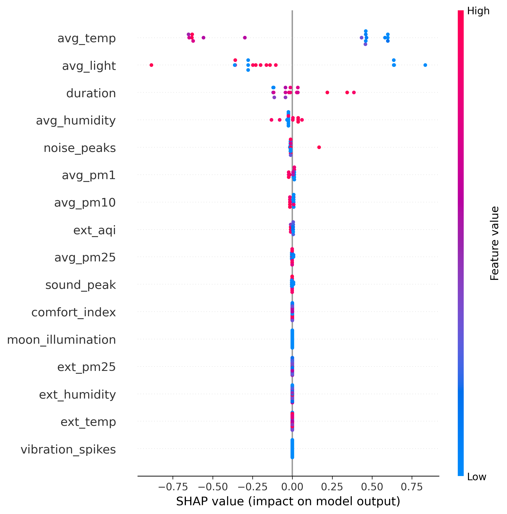
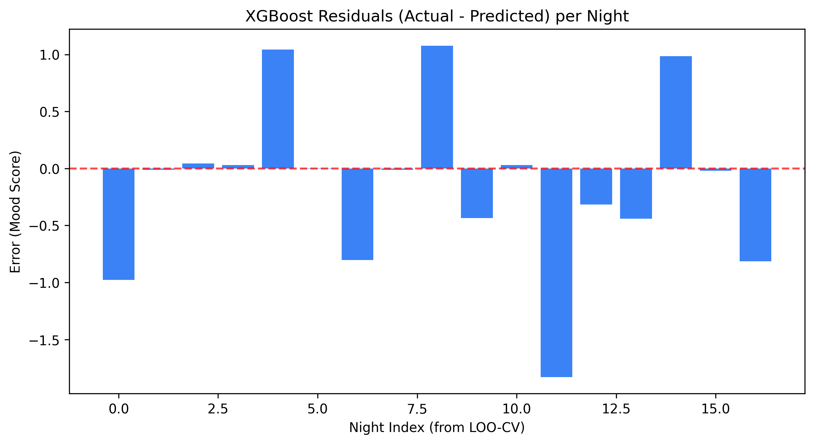
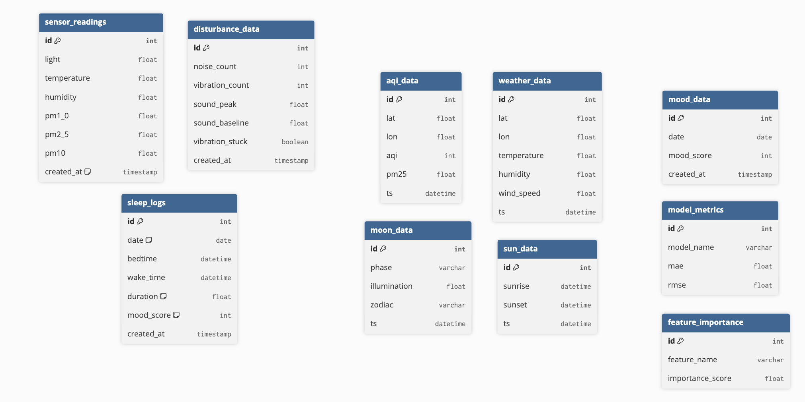

# 🌙 Indirect Sleep Quality Estimation

**Project Title**: Indirect Sleep Quality Estimation Using Environmental Disturbance Sensors
**Affiliation**: Department of Computer Engineering, Faculty of Engineering, Kasetsart University


A data analytics web application estimating sleep quality using **KidBright IoT** environmental sensors (Noise, Vibration, Light, PM2.5). The system integrates real-world mood feedback from Google Forms with high-frequency sensor data, **external environmental context** (weather, air quality, solar/lunar cycles), and applies machine learning to identify behavioural patterns.

---

## Features

- **Sleep Quality Scoring**: Nightly score (0–100) computed from actual sensor readings during your exact bedtime–wake window.
- **Google Forms Integration**: Automated ingestion of Bedtime, Wake Time, and 1–5 Mood Score logs via CSV export.
- **Disturbance Tracking**: 5-minute interval breakdown of noise peaks, vibration spikes, and ambient light.
- **Mood Correlation**: Scatter plot of sleep quality vs. morning mood score (1–5 scale).
- **ML Model Benchmarking & Pipeline Integration**: Predicts mood using three models (KNN, Decision Tree, XGBoost) using robust Scikit-Learn `Pipeline` standard scaling inside Leave-One-Out validation.
- **SHAP Summary Plot**: A natively generated explainability plot breaking down precisely which internal/external factors most pushed mood scores up or down.
- **Residual Analysis**: Evaluates prediction error (actual − predicted) per night in validation, verifying our XGBoost model is unbiased.
- **ML Model Benchmarking**: 3 models evaluated with **Leave-One-Out CV** on real data — KNN, Decision Tree, XGBoost. (See `results.md` for actual result numbers)
- **Feature Importance**: XGBoost gain-based analysis showing which factors (internal sensors + external context) most impact your specific sleep results. Purple = internal, cyan = external.
- **Integrated Environmental Intelligence**: Indoor vs outdoor comparisons — temporal alignment between your bedroom sensors and global weather/AQI data.
- **External Data**: Hourly weather, AQI, sunrise/sunset, and moon phase via external APIs.
- **Premium UI**: Glassmorphism dark-theme dashboard in Next.js with Recharts and Framer Motion.


---

## 🛠️ Tech Stack

| Layer | Technology |
|---|---|
| **Backend API** | FastAPI (Python 3.9+), Uvicorn |
| **Frontend** | Next.js 16 (App Router), Tailwind CSS v4, Framer Motion, Recharts |
| **Database** | MySQL 8.0+ (Remote host `iot.cpe.ku.ac.th`) |
| **ML Engine** | scikit-learn (KNN, Decision Tree), XGBoost, Pandas, NumPy |
| **External APIs** | OpenWeatherMap, IQAir, Sunrise-Sunset.org, MET Norway (moon) |
| **Testing** | Playwright (E2E, runs against live dev server) |

---

## Project Structure

```text
.
├── config.example.py            # Template for database configuration
├── config.py                    # Database credentials (not committed)
├── LICENSE                      # Project license
├── mood_responses.csv           # Google Form CSV export (source of truth)
├── README.md                    # This file
├── requirements.txt             # Python dependencies
├── sleep_controller.py          # FastAPI backend (Port 8001)
├── backend/                     # Backend Python modules
│   ├── calculate_metrics.py     # ML training + feature importance (runs offline)
│   ├── db_manager.py            # Shared PooledDB connection factory
│   ├── external_services.py     # Async fetchers for weather/AQI/sun/moon
│   ├── ingest_logs.py           # CSV → MySQL ingestor (mood_responses.csv)
│   └── init_db.py               # Creates all DB tables
├── DataAnalytics/               # Data analysis notebooks
│   └── sleep_analytics.ipynb    # Comprehensive 46-cell Jupyter notebook (13 sections)
├── DataCollection/              # Data collection scripts and schemas
│   ├── DatabaseSchema.sql       # Database schema definition
│   └── KidbrightSensor.py       # Sensor data collection script
└── frontend/                    # Next.js App (Port 3000)
    ├── eslint.config.mjs        # ESLint configuration
    ├── next-env.d.ts            # Next.js TypeScript declarations
    ├── next.config.ts           # Next.js configuration
    ├── package.json             # Node.js dependencies and scripts
    ├── playwright.config.ts     # Playwright test configuration
    ├── postcss.config.mjs       # PostCSS configuration
    ├── README.md                # Frontend-specific README
    ├── tsconfig.json            # TypeScript configuration
    ├── playwright-report/       # Playwright test reports
    ├── public/                  # Static assets
    ├── src/                     # Source code
    │   ├── app/                 # Next.js app router pages
    │   │   ├── dashboard/page.tsx # Sleep overview + quality trend (all dates)
    │   │   ├── analysis/page.tsx  # Night-level sensor breakdown
    │   │   ├── mood/page.tsx      # Mood vs sleep correlation scatter
    │   │   ├── environment/page.tsx # Indoor↔Outdoor comparison + PM2.5 & temp
    │   │   ├── models/page.tsx     # Integrated Intelligence — feature drivers
    │   │   └── external/page.tsx   # Live weather / AQI / moon data
    │   ├── components/          # React components
    │   └── lib/                 # Utility libraries
    ├── test-results/            # Test result outputs
    └── tests/                   # Playwright E2E tests
        ├── dashboard.spec.ts     # Dashboard page tests
        └── navigation.spec.ts    # Navigation tests
```

---

## Getting Started

### 1. Prerequisites
- Python 3.9+
- Node.js 18+
- MySQL credentials (copy `config.example.py` → `config.py`)

### 2. Python Setup

```bash
pip install -r requirements.txt
```

### 3. Data Pipeline (run once, in order)

```bash
# 1. Create all DB tables
python3 backend/init_db.py

# 2. Ingest your Google Form CSV export
python3 backend/ingest_logs.py

# 3. Train ML models and save metrics (requires ≥4 nights with sensor data)
python3 backend/calculate_metrics.py
```

### 4. Run the Backend API

```bash
python3 sleep_controller.py
# → API available at http://localhost:8001
# → Docs at http://localhost:8001/docs
```

### 5. Run the Frontend

```bash
cd frontend
npm install
npm run dev
# → Dashboard at http://localhost:3000/dashboard
```

---

## Sleep Quality Score Formula

The score (0–100) is computed per night from actual sensor readings within your bedtime–wake window:

```
Quality = 100 − duration_penalty − light_penalty − pm25_penalty − disturbance_penalty
```

| Component | Source | Cap |
|---|---|---|
| Duration penalty | `(7.0 − duration) × 12` if < 7 hrs | — |
| Light penalty | `(avg_lux / 1000) × 25` | 25 pts |
| PM2.5 penalty | `(avg_pm2.5 / 50) × 15` | 15 pts |
| Disturbance penalty | `noise×0.4 + vib×2 + (peak/500)×10` | 60 pts |

---

## Machine Learning Pipeline

Models are evaluated using **Leave-One-Out cross-validation** (appropriate for the small dataset). The target variable is your real **1–5 morning mood score** from Google Forms.

**Features used** (15+ columns): Internal sensor averages (temperature, humidity, light, PM1.0, PM2.5, PM10, noise, vibration, sound peak), sleep duration, external weather (outdoor temp, outdoor humidity, wind speed), external AQI (city-wide AQI, outdoor PM2.5), moon illumination, and 4 engineered features (temp insulation delta, log-light, moon phase numeric, disturbance index).

Re-run `calculate_metrics.py` any time new log entries are added to update metrics. This script will automatically generate a fresh `shap_summary_plot.png`.





---

## API Endpoints

| Endpoint | Description |
|---|---|
| `GET /sleep-score` | Nightly quality scores for all logged dates |
| `GET /disturbance-timeline/{date}` | 5-min sensor breakdown for a specific night |
| `GET /mood-correlation` | Pearson correlation + scatter data for mood vs quality |
| `GET /environment-impact` | 7-day PM2.5 + temperature vs sleep quality |
| `GET /model-comparison` | MAE/RMSE for all trained models |
| `GET /feature-importance` | XGBoost gain-based feature rankings |
| `GET /api/external-data` | Latest weather, AQI, sun, moon snapshots |
| `GET /api/integrated-environmental-trends` | 14-night indoor vs outdoor comparison |

---

## Running Tests

```bash
cd frontend
npx playwright install   # first time only
npm run test:e2e
```

Tests cover: page headings, metric card visibility, Recharts rendering, and navigation between all routes.

---

### Database Schema
Integrated data is stored across 14 tables on the Kasetsart University IoT host, including 4 external API tables (`weather_data`, `aqi_data`, `moon_data`, `sun_data`).

**Host/PMA**: [https://iot.cpe.ku.ac.th/pma/](https://iot.cpe.ku.ac.th/pma/)




---

## License

Developed for the DAQ and DA module: *"Indirect Sleep Quality Estimation Using Environmental Disturbance Sensors."*